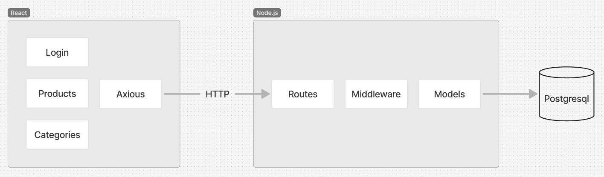
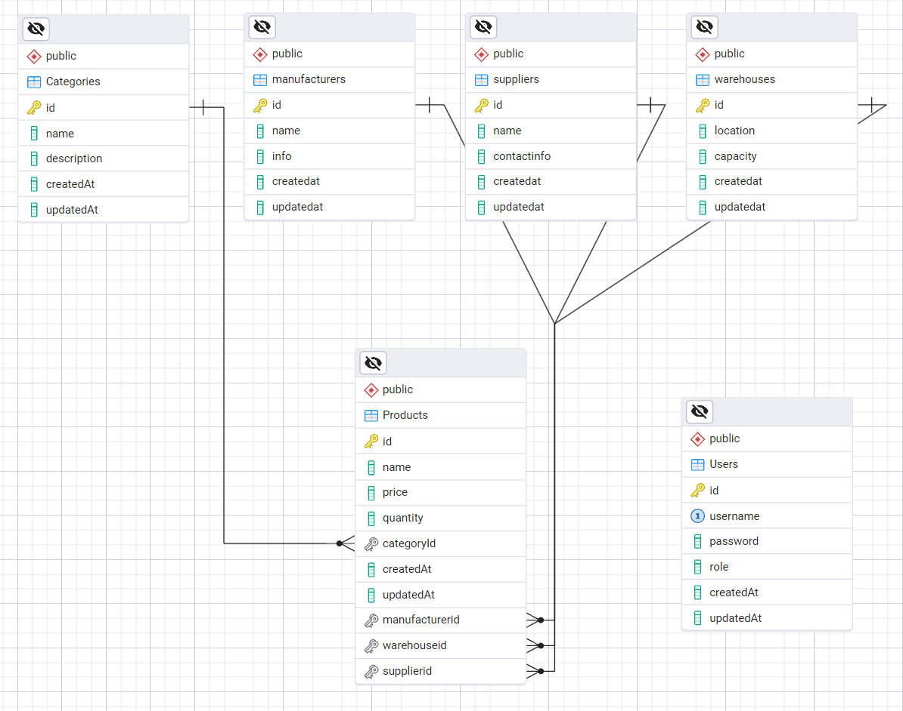

# Система управління аптечним складом

Проект створений для ефективного управління аптечним складом, включаючи роботу з товарами, категоріями та користувачами. Він дозволяє здійснювати додавання, редагування, видалення та пошук даних, а також забезпечує сортування товарів за різними параметрами. Основна мета — автоматизувати процеси управління складом та покращити облік ресурсів.

## Використані технології

 - **Frontend:** React, Material-UI для створення сучасного інтерфейсу.
 - **Backend:** Node.js, Express, Sequelize ORM для роботи з базою даних.
 - **База даних:** PostgreSQL для зберігання даних.
 - **Аутентифікація:** JWT (JSON Web Token) для безпечного доступу.
 - **Axios:** для обробки запитів до API.
## Реалізовані модулі та функціонал

### Backend 

#### Основні модулі:

- **Користувачі (users):**
  - Реєстрація, авторизація (JWT).
  - CRUD для управління користувачами (ім'я, роль, пароль).
  - Захищені маршрути (потрібен токен).

- **Товари (products):**
  - CRUD-операції для керування товарами.
  - Поля: назва, ціна, кількість, категорія.
  - Підтримка прив'язки товару до категорії через `categoryId`.
  - Підсвічування низьких запасів товарів (якщо кількість < 50).

- **Категорії (categories):**
  - CRUD-операції для управління категоріями (назва, опис).
  - Категорії використовуються для класифікації товарів.

#### Авторизація:
- Захист маршрутів з JWT.
- Ролі користувачів для обмеження доступу (наприклад, адміністратор або менеджер).
- Токен зберігається в `localStorage` для виконання захищених запитів.

#### База даних:
- Використовується PostgreSQL.
- Таблиці: `Users`, `Products`, `Categories`.

### Frontend

#### Основні сторінки та компоненти:

- **Навігація (NavBar):**
  - Ліворуч - назва додатка.
  - Праворуч - кнопки для навігації: Головна, Товари, Категорії, Користувачі, Вхід.

- **Керування користувачами (Users):**
  - **CRUD-операції:** Додавання, видалення користувачів.
  - **Поля:** ім'я користувача, пароль, роль.
  - **Пошук:** Реалізовано пошук користувачів за ім'ям і роллю.

- **Управління товарами (Products):**
  - **CRUD-операції:** Додавання, редагування, видалення товарів.
  - **Поля:** назва, ціна, кількість, категорія.
  - **Сортування:** За алфавітом, кількістю, ціною, категорією.
  - **Пошук:** Реалізовано пошук товарів за назвою та категорією.
  - **Підсвічування низьких запасів:** Кількість товару підсвічується червоним, якщо вона менше 50.

- **Управління категоріями (Categories):**
  - **CRUD-операції:** Додавання, редагування, видалення категорій.
  - **Поля:** назва, опис.
  - **Пошук:** Реалізовано пошук категорій за назвою та описом.
  - Опис обрізається, якщо він довгий, і показується повністю в `tooltip` при наведенні.

## Діаграма компонентів

## Зв'язки таблиць (ЕР-діаграма)

## Опис основних сценаріїв

#### 1. Додавання товару:

- **Користувач:** Вводить назву, ціну, кількість та вибирає категорію.

- **Frontend:**
  - Надсилає запит `POST /products` з даними товару.

- **Backend:**
  - Проводить валідацію даних для таблиці `Products`.

- **База даних:**
  - Виконує SQL-запит: `INSERT INTO Products ...`.

#### 2. Пошук товарів:

- **Frontend:**
  - Фільтрує список локально за введеним запитом.
  - Або надсилає запит `GET /products?query=...`.

- **Backend:**
  - Фільтрує товари за назвою та категорією.

- **База даних:**
  - Виконує SQL-запит: `SELECT * FROM Products WHERE name ILIKE '%query%'`.

#### 3. Авторизація користувача:

- **Frontend:**
  - Користувач вводить логін та пароль.
  - Надсилає запит `POST /auth/login`.

- **Backend:**
  - Перевіряє дані у таблиці `Users`.
  - Успішно авторизує та повертає JWT-токен.

- **Frontend:**
  - Зберігає токен у `localStorage` для подальшого використання.