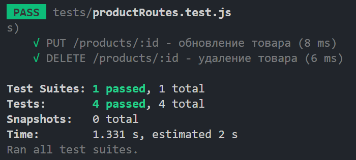

# Unit tests

У цьому розділі описано юніт-тести, які були реалізовані для перевірки функціональності модуля "Товари" у системі управління аптечним складом.

## Опис тестів

### POST /products - створення товару
Тест перевіряє:
- Чи можна створити новий товар.
- Чи повертається коректна відповідь зі статусом `201 Created`.
- Чи повертаються правильні дані про товар, включаючи назву, ціну, кількість та категорію.

### GET /products - отримання всіх товарів
Тест перевіряє:
- Чи можна отримати список усіх товарів.
- Чи повертається коректна відповідь зі статусом `200 OK`.
- Чи дані товарів у відповіді мають правильну структуру.

### PUT /products/:id - оновлення товару
Тест перевіряє:
- Чи можна оновити інформацію про існуючий товар.
- Чи повертається коректна відповідь зі статусом `200 OK`.
- Чи оновлюються дані товару, такі як назва, ціна, кількість та категорія.

### DELETE /products/:id - видалення товару
Тест перевіряє:
- Чи можна видалити існуючий товар.
- Чи повертається коректна відповідь зі статусом `200 OK`.
- Чи виводиться повідомлення `Товар успішно видалено`.

## Результати тестування

Всі тести виконані успішно.

## Використані інструменти

- **Jest** для написання тестів.
- **Supertest** для тестування HTTP-запитів.
- **Sequelize Mock** для мокування моделей бази даних.