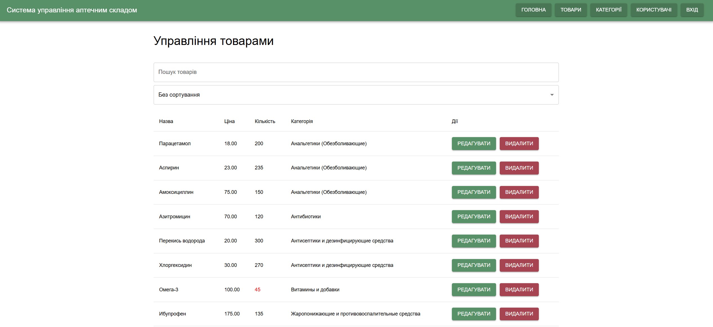
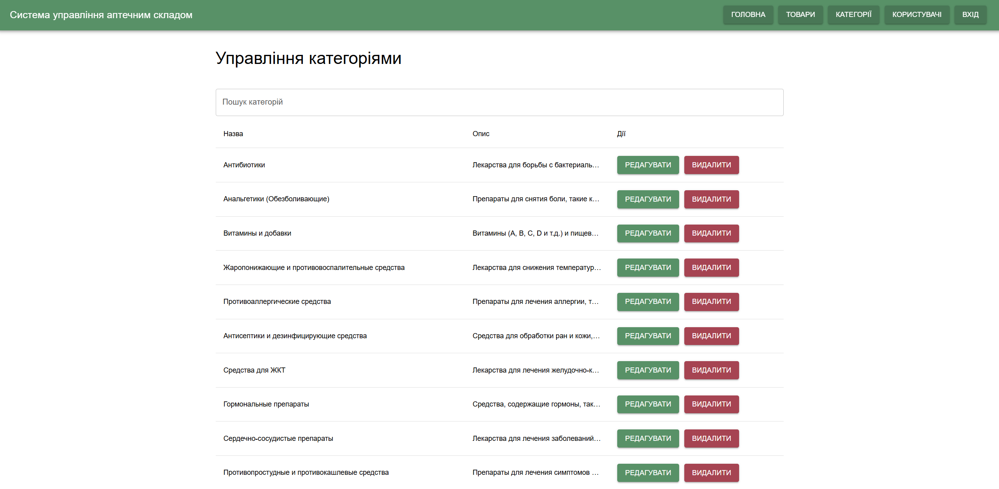

# Опис інтерфейсу

## Сторінка авторизації

## Головна сторінка

## Управління товарами

### Додавання товарів

### Редагування товарів

## Управління категоріями

### Додавання категорій

## Управління користувачами

# E2E тести

Для написання end to end тестів я використав фреймворк Cypress. Я реалізував тестування авторизації та CRUD сторінок Products, Categoties та Users.

---

## Результати тестування

### Тест 1: Тести авторизації

### Тест 2: Тести Products

### Тест 3: Тести Categoties

### Тест 4: Тести Users

